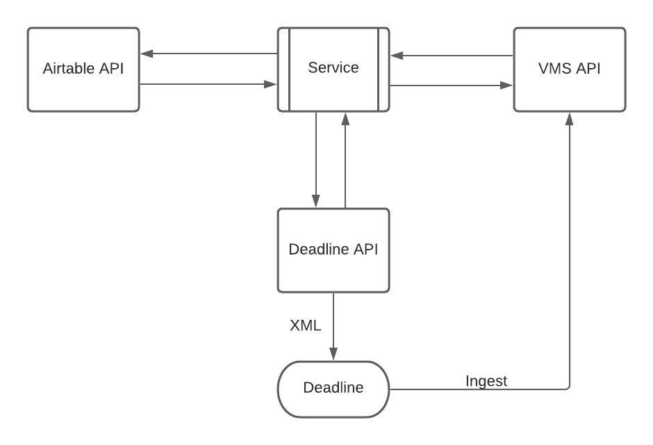
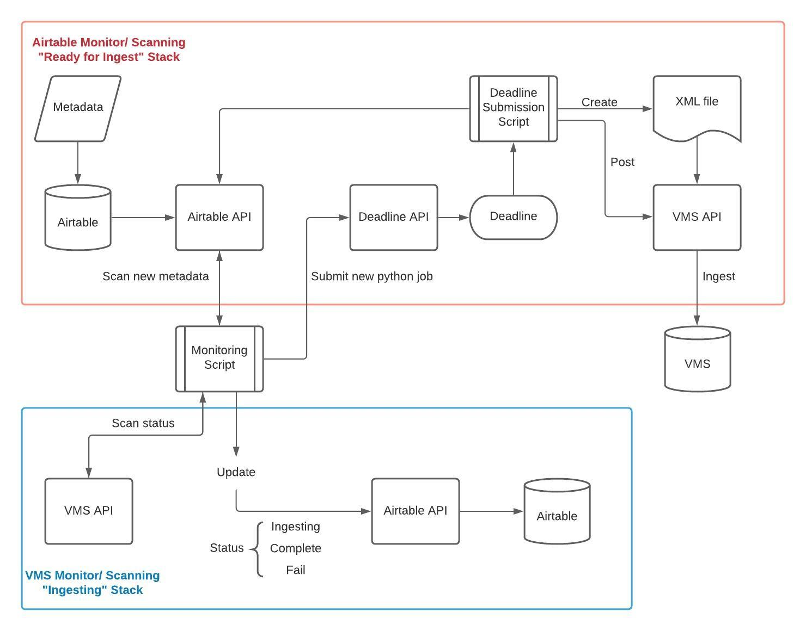

# VMS Ingest
Airtable for VMS ingesting.

## Getting Starte
### Built With
- Python3.7
- Deadline

### Dependencies
- Deadline Web Services
- request

## Usage
### Monitoring Services
- log in to vm 1515-deadline-1 under nto_rush
- run deadlinewebservice.exe on desktop
- run vms_ingest_monitor.bat on desktop

### Airtable
- mandatory fields: ['Record ID','File Name','Content Type','BRAND (VMS Channel)','Ingestor','VMS Record Name *Title']
- change the record Status to "Ready for Ingest"

## Documentation
### Paths
- Project Path: "Y:\\TOOLS\\EmerTech\\VMS_ingest"
- XML path: "Y:\\TOOLS\\EmerTech\\VMS_ingest\\xml_files"

### Files
- xml_ingest_standalone.py #python file for airtable and vms scanning.
- deadline_submit.py #python file for deadline to create xml and ingest to VMS
- airtable_parameters #this file store all the parameters for airtable API access in json format
- vms_parameters  #this file store all the parameters for vms API access in json format

### Diagrams
Simple architecture diagram

Detail airtable monitoring & vms monitoring diagram

